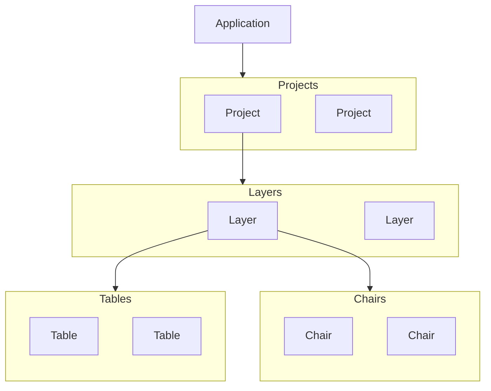
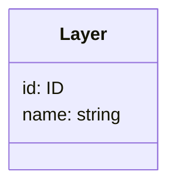
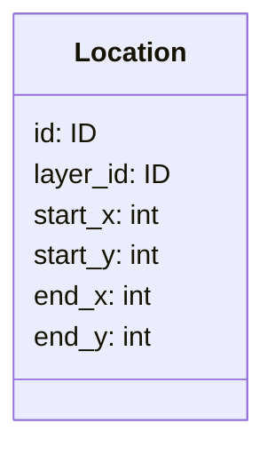
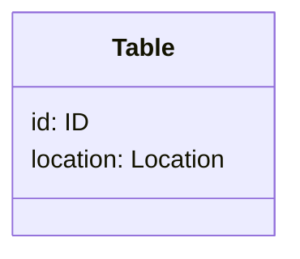
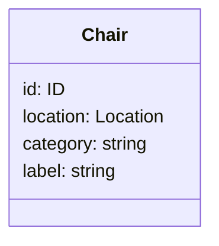

# planrassadki

- [planrassadki](#planrassadki)
	- [API](#api)
	- [Архитектура](#архитектура)
		- [Project](#project)
		- [Layer](#layer)
			- [Location](#location)
			- [Алгоритм определения пересечения](#алгоритм-определения-пересечения)
	- [Layer Children](#layer-children)
		- [Table](#table)
		- [Chair](#chair)

## API

[Swagger](https://planrassadki.github.io/api/)

## Архитектура

### Project

Главный элемент приложения. Может содержать несколько [слоев](#Layer). В проекте может быть несколько пользователей, а также пользователь может быть в нескольких проектах.

### Layer

Представляет из себя карту, на которой могут располагаться элементы такие как [столы](#Table), [стулья](#Chair), в будущем, могут быть и другие.
У каждого элемента слоя есть своя [позиция](#location). Элементы слоя не должны [пересекаться](#алгоритм-определения-пересечения). В будущем, слой сможет иметь изображение-подложку.

#### Location

Позиция элемента слоя указывает, где в проекте находится этот элемент. Для простоты [нахождения пересечений](#алгоритм-определения-пересечения) элементов, каждый элемент представляет из себя прямоугольник, который характеризуется двумя точками с координатами _start_x_, _start_y_ у первой и _end_x_, _end_y_ у второй.
Эти две точки указывают на конечное расположение элемента, то есть, когда будет добавлена возможность поворачивать элементы,
вместе со свойством rotation (определяющим угол поворота), также будут изменяться координаты этих двух точек.
Такая структура хранения информации о позиции элемента позволяет легче определять, [пересекает](#алгоритм-определения-пересечения) ли элемент другие.

#### Алгоритм определения пересечения

Так как каждый элемент является прямоугольником, характеризующимся двумя точками (_start_x_, _start_y_) и (_end_x_, _end_y_), то чтобы найти элементы пересекающие прямоугольник с координатами (:sX, :sY, :eX, :eY):

**WHERE**
start_x >= :sX **AND**
start_y >= :sY **AND**
end_x <= :eX **AND**
end_y <= :eY

## Layer Children

### Table

Простой элемент слоя

### Chair

Элемент слоя. Текст из поля **label** будет показан на карте над этим стулом.
На данный момент поле **category** нужно, чтобы на фронте подставлять необходимую картинку стула, в том числе и повернутую картинку.
